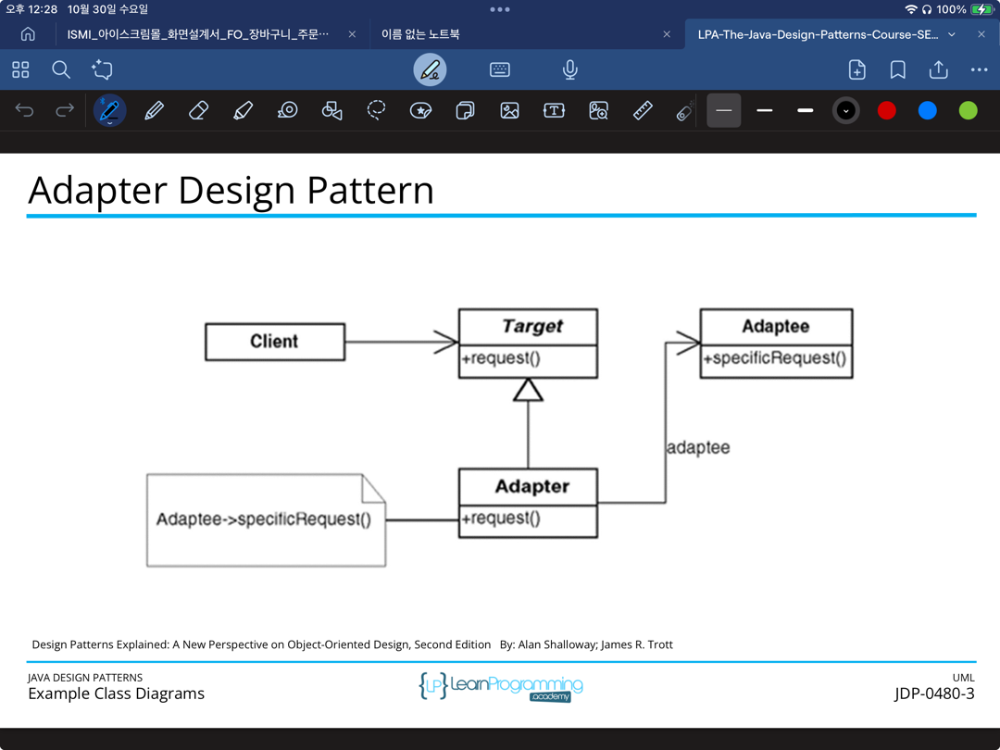

- 파일 변환기 구현
    - 서로 다른 파일 포맷을 지원하는 시스템을 위한 어댑터를 만들어 보세요. 예를 들어, TextFileReader, PdfFileReader, DocxFileReader 같은 클래스를 각각 정의하고,
      FileReaderAdapter를 통해 다양한 파일 포맷을 읽을 수 있도록 합니다. FileReaderAdapter가 공통 FileReader 인터페이스를 따르게 만들어서 다양한 파일을 동일한 방식으로
      다룰 수 있도록 해보세요.

- 다국어 번역 어댑터
    - 외부 번역 API들이 제공하는 인터페이스가 다를 때, 이를 통합하는 어댑터를 만들어 보세요. 예를 들어 GoogleTranslateAPI, NaverPapagoAPI 등이 각기 다른 메서드 구조를 가질
      때, TranslationService 인터페이스에 맞춘 어댑터들을 구현해 다국어 번역을 통합하는 시스템을 만들어 보세요.

- 결제 시스템 통합
    - 서로 다른 결제 제공자(PayPal, Stripe, 네이버페이 등)를 사용하는 어댑터를 구현해 보세요. 각 결제 제공자는 고유한 API를 갖지만, 이를 PaymentProcessor 인터페이스로 통일하는
      어댑터를 만들어서 결제 요청을 일관된 방식으로 처리할 수 있도록 해보세요.

- 알림 시스템 통합
    - 이메일, SMS, 푸시 알림 등 다양한 알림 채널을 제공하는 시스템을 어댑터로 통합해 보세요. EmailNotification, SMSNotification, PushNotification이 각각 다르게
      구현되어 있다면 NotificationService라는 공통 인터페이스를 만들어 이를 통해 일관된 방식으로 알림을 보낼 수 있도록 구현해 보세요.

- 로깅 시스템 통합
    - 서로 다른 로깅 라이브러리(e.g., Log4j, SLF4J, java.util.logging)에서 로그를 기록하는 시스템을 어댑터 패턴을 통해 통합하세요. 공통 인터페이스 Logger를 만들어, 이를
      사용하는
      시스템이 어떤 로깅 라이브러리를 사용하는지 몰라도 일관된 로그 기록 방식으로 로그를 기록하도록 해보세요.

